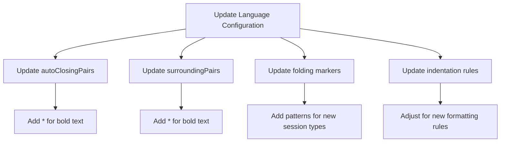
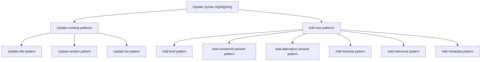
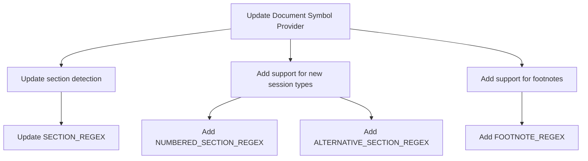
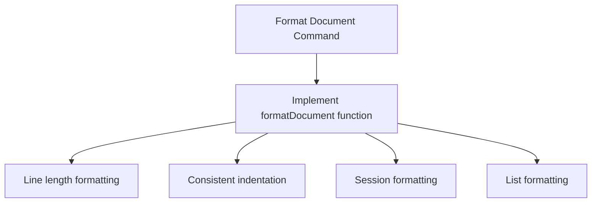
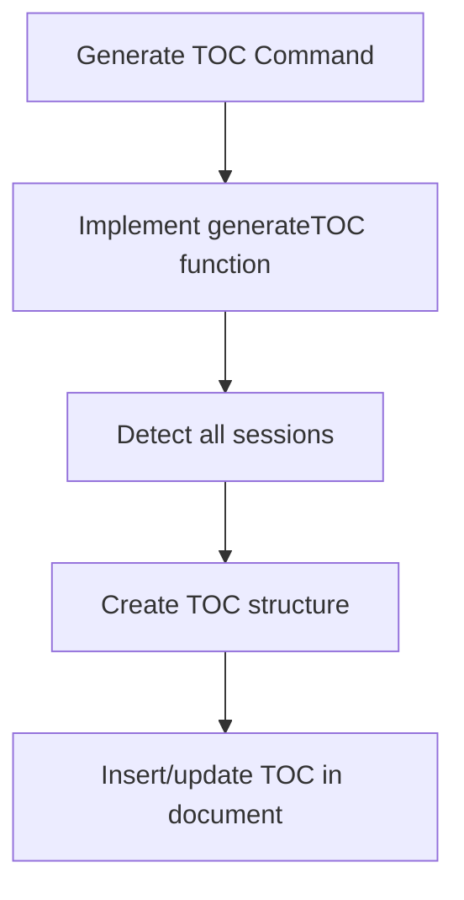
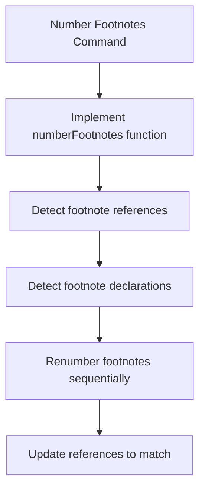
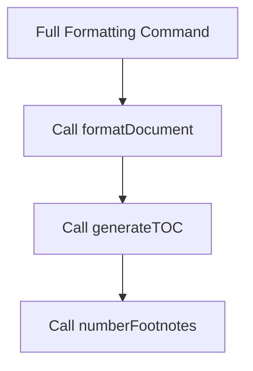
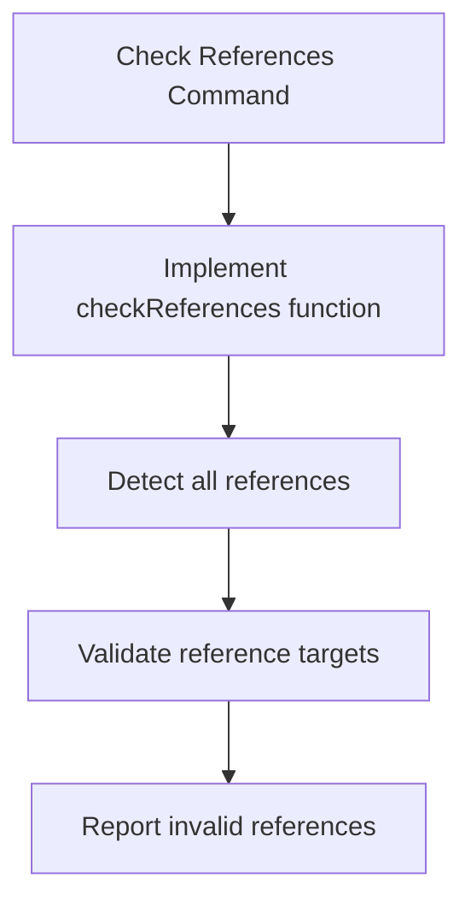

# Implementation Plan for TxtDoc Format v2 (.rfc)

## Overview

We need to implement the v2 format for .rfc files as defined in 'docs/format.rfc.txt'. This will be a complete replacement of the current implementation for .rfc files with no backward compatibility required. The implementation will be split into two main areas:

1. Syntax and Language Features
2. Extension Commands

## Syntax Changes Analysis

Key differences between the current format and the v2 format:

```mermaid
graph TD
    A[TxtDoc Format v2] --> B[New Syntax Features]
    A --> C[New Session Types]
    A --> D[Advanced Features]
    A --> E[Extension Commands]
    
    B --> B1[Bold text with *asterisks*]
    B --> B2[Improved section formatting]
    B --> B3[Consistent indentation rules]
    
    C --> C1[Formal Session Declaration]
    C --> C2[Numbered Session Declaration]
    C --> C3[Alternative Declaration with colon]
    
    D --> D1[References to documents/sections]
    D --> D2[Footnotes]
    D --> D3[Metadata headers]
    D --> D4[Document title]
    D --> D5[Table of contents]
    
    E --> E1[Format Document]
    E --> E2[Generate TOC]
    E --> E3[Number Footnotes]
    E --> E4[Full Formatting]
    E --> E5[Check References]
```

## Implementation Plan: Syntax and Language Features

### 1. Update Language Configuration

**Changes needed:**
- Update `language-configuration.json`:
  - Add `*` to autoClosingPairs and surroundingPairs
  - Update folding markers to recognize new session types
  - Update indentation rules for consistent formatting

### 2. Update Syntax Highlighting

**Changes needed:**
- Update `syntaxes/txtdoc.tmLanguage.json`:
  - Update existing patterns for titles, sections, lists
  - Add new patterns for:
    - Bold text (`*text*`)
    - Numbered sessions (`1. Session Name`)
    - Alternative sessions (`: Session Name`)
    - Footnotes (`[1] Footnote text`)
    - References (`see: path#anchor-id`)
    - Metadata headers (key-value pairs)

### 3. Update Document Symbol Provider

**Changes needed:**
- Update `TxtDocDocumentSymbolProvider` class in `extension.js`:
  - Update section detection regex
  - Add support for numbered sessions
  - Add support for alternative sessions
  - Add support for footnotes in the outline view

## Implementation Plan: Extension Commands

### 1. Format Document Command

**Changes needed:**
- Add a new command for formatting documents
- Implement functions to:
  - Ensure 80 character line length with soft wrapping
  - Apply consistent indentation
  - Format sessions according to the specification
  - Format lists correctly

### 2. Generate TOC Command

**Changes needed:**
- Add a new command for generating a table of contents
- Implement functions to:
  - Detect all sessions in the document
  - Create a properly formatted TOC
  - Insert or update the TOC in the document

### 3. Number Footnotes Command

**Changes needed:**
- Add a new command for numbering footnotes
- Implement functions to:
  - Detect footnote references (`[1]`)
  - Detect footnote declarations
  - Renumber footnotes sequentially
  - Update references to match the new numbers

### 4. Full Formatting Command

**Changes needed:**
- Add a new command that combines the other formatting commands
- Implement a function that calls the other formatting functions in sequence

### 5. Check References Command

**Changes needed:**
- Add a new command for checking references
- Implement functions to:
  - Detect all references in the document
  - Validate that reference targets exist
  - Report any invalid references

## File Changes Required

1. `extension.js`:
   - Update regular expressions for new syntax features
   - Add new document symbol provider patterns
   - Implement new commands
   - Update activation events

2. `package.json`:
   - Add new commands to the contributes section
   - Update activation events if needed

3. `syntaxes/txtdoc.tmLanguage.json`:
   - Update patterns for new syntax features
   - Add new patterns for new features

4. `language-configuration.json`:
   - Update configuration for new syntax features

## Testing Strategy

1. Create test files for each new feature:
   - Bold text test
   - Session types test
   - References test
   - Footnotes test
   - Metadata test
   - TOC test

2. Test each command individually:
   - Format Document
   - Generate TOC
   - Number Footnotes
   - Full Formatting
   - Check References

3. Test edge cases:
   - Empty documents
   - Very large documents
   - Documents with invalid syntax