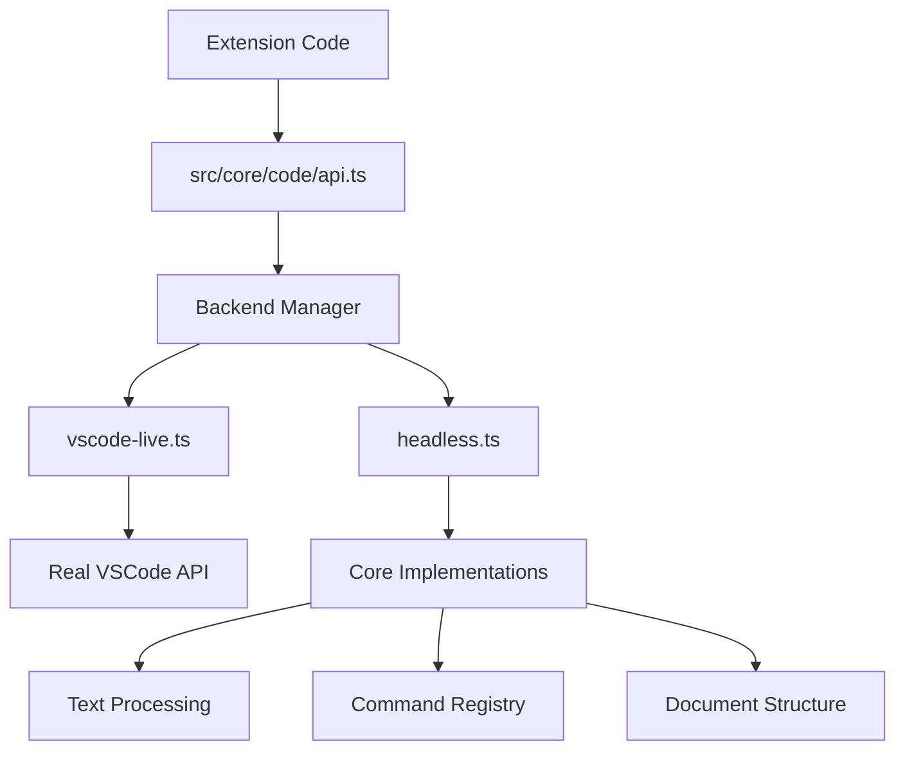

# VSCode API Backend System Implementation Plan (TypeScript)

## Overview

This document outlines a plan to create a backend system for the VSCode API that separates core functionality from VSCode-specific implementation. This approach recognizes that most of the extension's features can run headless, with only a few requiring the full VSCode environment.

The key insight is that we already have the source code for almost everything being tested, so we can implement real functionality rather than mocks for most cases.

## Architecture



## TypeScript Setup

To implement this system in TypeScript while maintaining compatibility with the existing JavaScript codebase, we'll need to:

1. Create a `tsconfig.json` file in the project root
2. Configure TypeScript to compile to JavaScript in the same directory
3. Define interfaces for the VSCode API types
4. Add type annotations to all functions, parameters, and return values

### TypeScript Configuration

```json
// tsconfig.json
{
  "compilerOptions": {
    "target": "ES2020",
    "module": "commonjs",
    "outDir": "./",
    "rootDir": "./",
    "sourceMap": true,
    "strict": true,
    "esModuleInterop": true,
    "skipLibCheck": true,
    "forceConsistentCasingInFileNames": true,
    "declaration": true
  },
  "include": [
    "src/**/*.ts"
  ],
  "exclude": [
    "node_modules"
  ]
}
```

### VSCode API Type Definitions

We'll create a type definitions file for the VSCode API:

```typescript
// src/core/code/types.ts
export interface Position {
  line: number;
  character: number;
  with(change: { line?: number; character?: number }): Position;
  isEqual(other: Position): boolean;
  isBefore(other: Position): boolean;
  isAfter(other: Position): boolean;
  translate(lineDelta?: number, characterDelta?: number): Position;
}

export interface Range {
  start: Position;
  end: Position;
  contains(positionOrRange: Position | Range): boolean;
  intersection(range: Range): Range | undefined;
  union(range: Range): Range;
  with(change: { start?: Position; end?: Position }): Range;
  isEmpty(): boolean;
  isSingleLine(): boolean;
}

export interface Selection extends Range {
  anchor: Position;
  active: Position;
  isReversed(): boolean;
  with(change: { anchor?: Position; active?: Position }): Selection;
}

export interface TextLine {
  text: string;
  lineNumber: number;
  range: Range;
  rangeIncludingLineBreak: Range;
  firstNonWhitespaceCharacterIndex: number;
  isEmptyOrWhitespace: boolean;
}

export interface Uri {
  scheme: string;
  authority: string;
  path: string;
  query: string;
  fragment: string;
  fsPath: string;
  with(change: { scheme?: string; authority?: string; path?: string; query?: string; fragment?: string }): Uri;
  toString(): string;
}

export interface TextDocument {
  uri: Uri;
  fileName: string;
  languageId: string;
  version: number;
  lineCount: number;
  isDirty: boolean;
  isClosed: boolean;
  getText(): string;
  lineAt(line: number | Position): TextLine;
  positionAt(offset: number): Position;
  offsetAt(position: Position): number;
  save(): Promise<boolean>;
}

export interface TextEditor {
  document: TextDocument;
  selection: Selection;
  selections: Selection[];
  visibleRanges: Range[];
  edit(callback: (editBuilder: TextEditorEdit) => void): Promise<boolean>;
  setDecorations(decorationType: TextEditorDecorationType, ranges: Range[]): void;
}

export interface TextEditorEdit {
  replace(range: Range, text: string): void;
  insert(position: Position, text: string): void;
  delete(range: Range): void;
}

export interface TextEditorDecorationType {
  id: string;
  options: any;
}

export interface WorkspaceEdit {
  replace(uri: Uri, range: Range, newText: string): void;
  delete(uri: Uri, range: Range): void;
  insert(uri: Uri, position: Position, newText: string): void;
  entries(): [Uri, TextEdit[]][];
}

export interface TextEdit {
  range: Range;
  newText: string;
}

export interface Diagnostic {
  range: Range;
  message: string;
  severity: DiagnosticSeverity;
  source?: string;
  code?: string | number;
}

export enum DiagnosticSeverity {
  Error = 0,
  Warning = 1,
  Information = 2,
  Hint = 3
}

export interface DiagnosticCollection {
  name: string;
  set(uri: Uri, diagnostics: Diagnostic[]): void;
  delete(uri: Uri): void;
  clear(): void;
  dispose(): void;
}

export interface DocumentSymbol {
  name: string;
  detail: string;
  kind: SymbolKind;
  range: Range;
  selectionRange: Range;
  children: DocumentSymbol[];
}

export enum SymbolKind {
  File = 0,
  Module = 1,
  Namespace = 2,
  Package = 3,
  Class = 4,
  Method = 5,
  Property = 6,
  Field = 7,
  Constructor = 8,
  Enum = 9,
  Interface = 10,
  Function = 11,
  Variable = 12,
  Constant = 13,
  String = 14,
  Number = 15,
  Boolean = 16,
  Array = 17,
  Object = 18,
  Key = 19,
  Null = 20,
  EnumMember = 21,
  Struct = 22,
  Event = 23,
  Operator = 24,
  TypeParameter = 25
}

export interface DocumentLink {
  range: Range;
  target?: Uri;
}

export interface FoldingRange {
  start: number;
  end: number;
  kind?: FoldingRangeKind;
}

export enum FoldingRangeKind {
  Comment = 1,
  Imports = 2,
  Region = 3
}

export interface CompletionItem {
  label: string;
  kind?: CompletionItemKind;
  detail?: string;
  documentation?: string | MarkdownString;
  sortText?: string;
  filterText?: string;
  insertText?: string;
  range?: Range;
}

export enum CompletionItemKind {
  Text = 0,
  Method = 1,
  Function = 2,
  Constructor = 3,
  Field = 4,
  Variable = 5,
  Class = 6,
  Interface = 7,
  Module = 8,
  Property = 9,
  Unit = 10,
  Value = 11,
  Enum = 12,
  Keyword = 13,
  Snippet = 14,
  Color = 15,
  File = 16,
  Reference = 17,
  Folder = 18,
  EnumMember = 19,
  Constant = 20,
  Struct = 21,
  Event = 22,
  Operator = 23,
  TypeParameter = 24
}

export interface MarkdownString {
  value: string;
  isTrusted?: boolean;
  supportThemeIcons?: boolean;
}

export interface CancellationToken {
  isCancellationRequested: boolean;
  onCancellationRequested: Event<any>;
}

export interface Event<T> {
  (listener: (e: T) => any, thisArgs?: any, disposables?: Disposable[]): Disposable;
}

export interface Disposable {
  dispose(): any;
}

export interface OutputChannel {
  name: string;
  append(value: string): void;
  appendLine(value: string): void;
  clear(): void;
  show(): void;
  hide(): void;
  dispose(): void;
}

export interface WorkspaceFolder {
  uri: Uri;
  name: string;
  index: number;
}

export interface DocumentSymbolProvider {
  provideDocumentSymbols(document: TextDocument, token: CancellationToken): DocumentSymbol[] | Promise<DocumentSymbol[]>;
}

export interface DocumentLinkProvider {
  provideDocumentLinks(document: TextDocument, token: CancellationToken): DocumentLink[] | Promise<DocumentLink[]>;
  resolveDocumentLink?(link: DocumentLink, token: CancellationToken): DocumentLink | Promise<DocumentLink>;
}

export interface FoldingRangeProvider {
  provideFoldingRanges(document: TextDocument, context: FoldingContext, token: CancellationToken): FoldingRange[] | Promise<FoldingRange[]>;
}

export interface FoldingContext {
  maxRanges?: number;
}

export interface CompletionItemProvider {
  provideCompletionItems(document: TextDocument, position: Position, token: CancellationToken, context: CompletionContext): CompletionItem[] | Promise<CompletionItem[]>;
  resolveCompletionItem?(item: CompletionItem, token: CancellationToken): CompletionItem | Promise<CompletionItem>;
}

export interface CompletionContext {
  triggerKind: CompletionTriggerKind;
  triggerCharacter?: string;
}

export enum CompletionTriggerKind {
  Invoke = 0,
  TriggerCharacter = 1,
  TriggerForIncompleteCompletions = 2
}

export interface VSCodeAPI {
  Position: new (line: number, character: number) => Position;
  Range: new (startLine: number, startCharacter: number, endLine: number, endCharacter: number) => Range;
  Range: new (start: Position, end: Position) => Range;
  Selection: new (anchorLine: number, anchorCharacter: number, activeLine: number, activeCharacter: number) => Selection;
  Selection: new (anchor: Position, active: Position) => Selection;
  Uri: {
    file(path: string): Uri;
    parse(value: string): Uri;
  };
  
  workspace: {
    openTextDocument(uri: Uri): Promise<TextDocument>;
    openTextDocument(fileName: string): Promise<TextDocument>;
    applyEdit(edit: WorkspaceEdit): Promise<boolean>;
    getWorkspaceFolder(uri: Uri): WorkspaceFolder | undefined;
  };
  
  window: {
    activeTextEditor: TextEditor | undefined;
    showTextDocument(document: TextDocument): Promise<TextEditor>;
    createOutputChannel(name: string): OutputChannel;
    showInformationMessage(message: string): Promise<string | undefined>;
    showWarningMessage(message: string): Promise<string | undefined>;
    showErrorMessage(message: string): Promise<string | undefined>;
    createTextEditorDecorationType(options: any): TextEditorDecorationType;
  };
  
  languages: {
    registerDocumentSymbolProvider(selector: any, provider: DocumentSymbolProvider): Disposable;
    registerDocumentLinkProvider(selector: any, provider: DocumentLinkProvider): Disposable;
    registerFoldingRangeProvider(selector: any, provider: FoldingRangeProvider): Disposable;
    registerCompletionItemProvider(selector: any, provider: CompletionItemProvider, ...triggerCharacters: string[]): Disposable;
    createDiagnosticCollection(name: string): DiagnosticCollection;
  };
  
  commands: {
    executeCommand(command: string, ...args: any[]): Promise<any>;
    registerCommand(command: string, callback: (...args: any[]) => any): Disposable;
    getCommands(): Promise<string[]>;
  };
}

export interface Backend extends VSCodeAPI {
  // Additional methods for testing
  setDocumentContent?(uri: Uri, content: string): TextDocument;
}
```

## Implementation Plan

### 1. Create the Backend System Structure

#### Main API Module

Create a new module at `src/core/code/api.ts` that will:
- Export a consistent API surface that matches the VSCode API used in the project
- Direct calls to the appropriate backend based on configuration

```typescript
// src/core/code/api.ts
import { BackendManager } from './backend-manager';
import { VSCodeAPI } from './types';

// Export the API that matches the VSCode API surface used in the project
const api: VSCodeAPI = {
  // Document/Editor APIs
  Position: BackendManager.current.Position,
  Range: BackendManager.current.Range,
  Selection: BackendManager.current.Selection,
  Uri: BackendManager.current.Uri,
  
  // Workspace APIs
  workspace: {
    openTextDocument: (...args: any[]) => BackendManager.current.workspace.openTextDocument(...args),
    applyEdit: (...args: any[]) => BackendManager.current.workspace.applyEdit(...args),
    getWorkspaceFolder: (...args: any[]) => BackendManager.current.workspace.getWorkspaceFolder(...args),
  },
  
  // Window APIs
  window: {
    get activeTextEditor() { return BackendManager.current.window.activeTextEditor; },
    showTextDocument: (...args: any[]) => BackendManager.current.window.showTextDocument(...args),
    createOutputChannel: (...args: any[]) => BackendManager.current.window.createOutputChannel(...args),
    showInformationMessage: (...args: any[]) => BackendManager.current.window.showInformationMessage(...args),
    showWarningMessage: (...args: any[]) => BackendManager.current.window.showWarningMessage(...args),
    showErrorMessage: (...args: any[]) => BackendManager.current.window.showErrorMessage(...args),
    createTextEditorDecorationType: (...args: any[]) => BackendManager.current.window.createTextEditorDecorationType(...args),
  },
  
  // Language APIs
  languages: {
    registerDocumentSymbolProvider: (...args: any[]) => BackendManager.current.languages.registerDocumentSymbolProvider(...args),
    registerDocumentLinkProvider: (...args: any[]) => BackendManager.current.languages.registerDocumentLinkProvider(...args),
    registerFoldingRangeProvider: (...args: any[]) => BackendManager.current.languages.registerFoldingRangeProvider(...args),
    registerCompletionItemProvider: (...args: any[]) => BackendManager.current.languages.registerCompletionItemProvider(...args),
    createDiagnosticCollection: (...args: any[]) => BackendManager.current.languages.createDiagnosticCollection(...args),
  },
  
  // Command APIs
  commands: {
    executeCommand: (...args: any[]) => BackendManager.current.commands.executeCommand(...args),
    registerCommand: (...args: any[]) => BackendManager.current.commands.registerCommand(...args),
    getCommands: (...args: any[]) => BackendManager.current.commands.getCommands(...args),
  },
};

export = api;
```

#### Backend Manager

Create a backend manager that handles backend selection and initialization:

```typescript
// src/core/code/backend-manager.ts
import { VSCodeLiveBackend } from './backends/vscode-live';
import { HeadlessBackend } from './backends/headless';
import { Backend } from './types';

class BackendManager {
  private _backends: Record<string, Backend> = {};
  private _currentBackend: string = 'vscode-live';
  
  constructor() {
    this._backends = {
      'vscode-live': new VSCodeLiveBackend(),
      'headless': new HeadlessBackend()
    };
  }
  
  get current(): Backend {
    return this._backends[this._currentBackend];
  }
  
  setBackend(name: string): Backend {
    if (!this._backends[name]) {
      throw new Error(`Backend not found: ${name}`);
    }
    this._currentBackend = name;
    return this.current;
  }
  
  registerBackend(name: string, backend: Backend): void {
    this._backends[name] = backend;
  }
}

// Create a singleton instance
export const BackendManager = new BackendManager();
```

### 2. Implement the Headless Backend

Create a backend that implements core functionality without VSCode dependencies:

```typescript
// src/core/code/backends/headless.ts
import { EventEmitter } from 'events';
import * as path from 'path';
import * as fs from 'fs';
import {
  Backend,
  Position,
  Range,
  Selection,
  TextLine,
  Uri,
  TextDocument,
  TextEditor,
  TextEditorEdit,
  TextEditorDecorationType,
  WorkspaceEdit,
  TextEdit,
  Diagnostic,
  DiagnosticSeverity,
  DiagnosticCollection,
  DocumentSymbol,
  SymbolKind,
  DocumentLink,
  FoldingRange,
  FoldingRangeKind,
  CompletionItem,
  CompletionItemKind,
  CancellationToken,
  Disposable,
  OutputChannel,
  WorkspaceFolder,
  DocumentSymbolProvider,
  DocumentLinkProvider,
  FoldingRangeProvider,
  CompletionItemProvider,
  FoldingContext,
  CompletionContext,
  CompletionTriggerKind
} from '../types';

// Import the actual command implementations from the extension
const formatCommands = require('../../../../extension/formatCommands');
const footnoteCommands = require('../../../../extension/footnoteCommands');
const numberingCommands = require('../../../../extension/numberingCommands');
// Import other command modules as needed

export class HeadlessBackend implements Backend {
  private _documents: Map<string, TextDocument> = new Map();
  private _editors: Map<string, TextEditor> = new Map();
  private _activeEditor: TextEditor | undefined;
  private _commandRegistry: Map<string, (...args: any[]) => any> = new Map();
  private _eventEmitter: EventEmitter = new EventEmitter();
  private _documentSymbolProvider: DocumentSymbolProvider | null = null;
  private _documentLinkProvider: DocumentLinkProvider | null = null;
  private _foldingRangeProvider: FoldingRangeProvider | null = null;
  private _completionItemProvider: CompletionItemProvider | null = null;
  
  constructor() {
    // Initialize the backend
    this._init();
  }
  
  private _init(): void {
    // Initialize core classes
    this._initCoreClasses();
    
    // Initialize workspace APIs
    this._initWorkspace();
    
    // Initialize window APIs
    this._initWindow();
    
    // Initialize language APIs
    this._initLanguages();
    
    // Initialize command APIs and register extension commands
    this._initCommands();
  }
  
  private _initCoreClasses(): void {
    // Position class - real implementation
    this.Position = class implements Position {
      constructor(public line: number, public character: number) {}
      
      with(change: { line?: number; character?: number } = {}): Position {
        return new HeadlessPosition(
          change.line !== undefined ? change.line : this.line,
          change.character !== undefined ? change.character : this.character
        );
      }
      
      isEqual(other: Position): boolean {
        return this.line === other.line && this.character === other.character;
      }
      
      isBefore(other: Position): boolean {
        if (this.line < other.line) {
          return true;
        }
        if (this.line === other.line && this.character < other.character) {
          return true;
        }
        return false;
      }
      
      isAfter(other: Position): boolean {
        if (this.line > other.line) {
          return true;
        }
        if (this.line === other.line && this.character > other.character) {
          return true;
        }
        return false;
      }
      
      translate(lineDelta: number = 0, characterDelta: number = 0): Position {
        return new HeadlessPosition(this.line + lineDelta, this.character + characterDelta);
      }
    } as any;
    
    const HeadlessPosition = this.Position;
    
    // Range class - real implementation
    this.Range = class implements Range {
      start: Position;
      end: Position;
      
      constructor(startLine: number | Position, startCharacter: number | Position, endLine?: number, endCharacter?: number) {
        if (startLine instanceof HeadlessPosition) {
          this.start = startLine;
          this.end = startCharacter as Position;
        } else {
          this.start = new HeadlessPosition(startLine as number, startCharacter as number);
          this.end = new HeadlessPosition(endLine as number, endCharacter as number);
        }
      }
      
      contains(positionOrRange: Position | Range): boolean {
        if (positionOrRange instanceof HeadlessPosition) {
          const position = positionOrRange;
          return (position.isAfter(this.start) || position.isEqual(this.start)) &&
                 (position.isBefore(this.end) || position.isEqual(this.end));
        }
        
        if (positionOrRange instanceof HeadlessRange) {
          const range = positionOrRange;
          return this.contains(range.start) && this.contains(range.end);
        }
        
        return false;
      }
      
      intersection(range: Range): Range | undefined {
        const start = this.start.isBefore(range.start) ? range.start : this.start;
        const end = this.end.isAfter(range.end) ? range.end : this.end;
        
        if (start.isAfter(end)) {
          return undefined;
        }
        
        return new HeadlessRange(start, end);
      }
      
      union(range: Range): Range {
        const start = this.start.isBefore(range.start) ? this.start : range.start;
        const end = this.end.isAfter(range.end) ? this.end : range.end;
        
        return new HeadlessRange(start, end);
      }
      
      with(change: { start?: Position; end?: Position } = {}): Range {
        let start = this.start;
        let end = this.end;
        
        if (change.start !== undefined) {
          start = change.start;
        }
        
        if (change.end !== undefined) {
          end = change.end;
        }
        
        if (start === this.start && end === this.end) {
          return this;
        }
        
        return new HeadlessRange(start, end);
      }
      
      isEmpty(): boolean {
        return this.start.isEqual(this.end);
      }
      
      isSingleLine(): boolean {
        return this.start.line === this.end.line;
      }
    } as any;
    
    const HeadlessRange = this.Range;
    
    // Selection class - real implementation
    this.Selection = class extends HeadlessRange implements Selection {
      anchor: Position;
      active: Position;
      
      constructor(anchorLine: number | Position, anchorCharacter: number | Position, activeLine?: number, activeCharacter?: number) {
        if (anchorLine instanceof HeadlessPosition) {
          super(anchorLine, anchorCharacter as Position);
          this.anchor = anchorLine;
          this.active = anchorCharacter as Position;
        } else {
          super(anchorLine as number, anchorCharacter as number, activeLine as number, activeCharacter as number);
          this.anchor = new HeadlessPosition(anchorLine as number, anchorCharacter as number);
          this.active = new HeadlessPosition(activeLine as number, activeCharacter as number);
        }
      }
      
      isReversed(): boolean {
        return this.anchor.isAfter(this.active);
      }
      
      with(change: { anchor?: Position; active?: Position } = {}): Selection {
        let anchor = this.anchor;
        let active = this.active;
        
        if (change.anchor !== undefined) {
          anchor = change.anchor;
        }
        
        if (change.active !== undefined) {
          active = change.active;
        }
        
        if (anchor === this.anchor && active === this.active) {
          return this;
        }
        
        return new HeadlessSelection(anchor, active);
      }
    } as any;
    
    const HeadlessSelection = this.Selection;
    
    // TextLine class - real implementation
    class HeadlessTextLine implements TextLine {
      text: string;
      lineNumber: number;
      range: Range;
      rangeIncludingLineBreak: Range;
      firstNonWhitespaceCharacterIndex: number;
      isEmptyOrWhitespace: boolean;
      
      constructor(text: string, lineNumber: number, range: Range) {
        this.text = text;
        this.lineNumber = lineNumber;
        this.range = range;
        this.rangeIncludingLineBreak = new HeadlessRange(
          range.start,
          new HeadlessPosition(lineNumber, text.length + 1)
        );
        this.firstNonWhitespaceCharacterIndex = this._getFirstNonWhitespaceIndex();
        this.isEmptyOrWhitespace = this.firstNonWhitespaceCharacterIndex === -1;
      }
      
      private _getFirstNonWhitespaceIndex(): number {
        for (let i = 0; i < this.text.length; i++) {
          if (!/\s/.test(this.text[i])) {
            return i;
          }
        }
        return -1;
      }
    }
    
    this.TextLine = HeadlessTextLine as any;
    
    // Uri class - real implementation
    this.Uri = class implements Uri {
      scheme: string;
      authority: string;
      path: string;
      query: string;
      fragment: string;
      fsPath: string;
      
      constructor(scheme: string, authority: string, path: string, query: string, fragment: string) {
        this.scheme = scheme;
        this.authority = authority;
        this.path = path;
        this.query = query;
        this.fragment = fragment;
        this.fsPath = this._getFsPath();
      }
      
      private _getFsPath(): string {
        if (this.scheme === 'file') {
          return this.path;
        }
        return '';
      }
      
      with(change: { scheme?: string; authority?: string; path?: string; query?: string; fragment?: string } = {}): Uri {
        return new HeadlessUri(
          change.scheme !== undefined ? change.scheme : this.scheme,
          change.authority !== undefined ? change.authority : this.authority,
          change.path !== undefined ? change.path : this.path,
          change.query !== undefined ? change.query : this.query,
          change.fragment !== undefined ? change.fragment : this.fragment
        );
      }
      
      toString(): string {
        let result = '';
        
        if (this.scheme) {
          result += this.scheme + ':';
        }
        
        if (this.authority || this.scheme === 'file') {
          result += '//';
        }
        
        if (this.authority) {
          result += this.authority;
        }
        
        if (this.path) {
          result += this.path;
        }
        
        if (this.query) {
          result += '?' + this.query;
        }
        
        if (this.fragment) {
          result += '#' + this.fragment;
        }
        
        return result;
      }
      
      static file(path: string): Uri {
        return new HeadlessUri('file', '', path, '', '');
      }
      
      static parse(value: string): Uri {
        // Simple implementation for common cases
        if (value.startsWith('file://')) {
          return HeadlessUri.file(value.substring(7));
        }
        
        // For other schemes, a more complex implementation would be needed
        throw new Error('Uri parsing not fully implemented');
      }
    } as any;
    
    const HeadlessUri = this.Uri;
    
    // Set Uri static methods
    this.Uri.file = HeadlessUri.file;
    this.Uri.parse = HeadlessUri.parse;
  }
  
  private _initWorkspace(): void {
    this.workspace = {
      openTextDocument: async (uriOrPath: Uri | string): Promise<TextDocument> => {
        // If it's a string, treat it as a path
        const path = typeof uriOrPath === 'string' ? uriOrPath : uriOrPath.fsPath;
        
        // Check if we already have this document
        if (this._documents.has(path)) {
          return this._documents.get(path) as TextDocument;
        }
        
        // Try to read the file if it exists
        let content = '';
        try {
          content = fs.readFileSync(path, 'utf8');
        } catch (error) {
          // File doesn't exist or can't be read, create an empty document
        }
        
        // Create a new document
        const document = this._createTextDocument(content, { path }, path.endsWith('.rfc') ? 'rfcdoc' : 'plaintext');
        this._documents.set(path, document);
        return document;
      },
      
      applyEdit: async (edit: WorkspaceEdit): Promise<boolean> => {
        // Apply the edit to the appropriate documents
        for (const [uri, edits] of edit.entries()) {
          const document = this._documents.get(uri.fsPath);
          if (document) {
            for (const textEdit of edits) {
              // Apply the edit to the document
              this._applyTextEdit(document, textEdit);
            }
          }
        }
        return true;
      },
      
      getWorkspaceFolder: (uri: Uri): WorkspaceFolder | undefined => {
        // Simple implementation that returns a mock workspace folder
        return { uri, name: path.basename(path.dirname(uri.fsPath)), index: 0 };
      },
    };
  }
  
  private _initWindow(): void {
    const self = this;
    
    this.window = {
      get activeTextEditor(): TextEditor | undefined { 
        return self._activeEditor; 
      },
      
      showTextDocument: async (document: TextDocument): Promise<TextEditor> => {
        // Create an editor for the document if it doesn't exist
        if (!this._editors.has(document.uri.fsPath)) {
          const editor = this._createTextEditor(document);
          this._editors.set(document.uri.fsPath, editor);
        }
        
        // Set as active editor
        this._activeEditor = this._editors.get(document.uri.fsPath);
        return this._activeEditor as TextEditor;
      },
      
      createOutputChannel: (name: string): OutputChannel => {
        return {
          name,
          appendLine: (text: string): void => { console.log(`[${name}] ${text}`); },
          append: (text: string): void => { process.stdout.write(`[${name}] ${text}`); },
          clear: (): void => {},
          show: (): void => {},
          hide: (): void => {},
          dispose: (): void => {}
        };
      },
      
      showInformationMessage: (message: string): Promise<string | undefined> => {
        console.log(`[INFO] ${message}`);
        return Promise.resolve(undefined);
      },
      
      showWarningMessage: (message: string): Promise<string | undefined> => {
        console.warn(`[WARNING] ${message}`);
        return Promise.resolve(undefined);
      },
      
      showErrorMessage: (message: string): Promise<string | undefined> => {
        console.error(`[ERROR] ${message}`);
        return Promise.resolve(undefined);
      },
      
      createTextEditorDecorationType: (options: any): TextEditorDecorationType => {
        // Return a simple object that can be used with setDecorations
        return { id: Math.random().toString(36).substring(2, 9), options };
      },
    };
  }
  
  private _initLanguages(): void {
    // Import the actual provider implementations from the extension
    const DocumentSymbolProvider = require('../../../../extension/documentSymbolProvider');
    const DocumentLinkProvider = require('../../../../extension/documentLinkProvider');
    // Import other providers as needed
    
    this.languages = {
      registerDocumentSymbolProvider: (selector: any, provider: DocumentSymbolProvider): Disposable => {
        this._documentSymbolProvider = provider;
        return { dispose: () => { this._documentSymbolProvider = null; } };
      },
      
      registerDocumentLinkProvider: (selector: any, provider: DocumentLinkProvider): Disposable => {
        this._documentLinkProvider = provider;
        return { dispose: () => { this._documentLinkProvider = null; } };
      },
      
      registerFoldingRangeProvider: (selector: any, provider: FoldingRangeProvider): Disposable => {
        this._foldingRangeProvider = provider;
        return { dispose: () => { this._foldingRangeProvider = null; } };
      },
      
      registerCompletionItemProvider: (selector: any, provider: CompletionItemProvider, ...triggerCharacters: string[]): Disposable => {
        this._completionItemProvider = provider;
        return { dispose: () => { this._completionItemProvider = null; } };
      },
      
      createDiagnosticCollection: (name: string): DiagnosticCollection => {
        return {
          name,
          set: (uri: Uri, diagnostics: Diagnostic[]): void => { /* Store diagnostics */ },
          delete: (uri: Uri): void => { /* Delete diagnostics */ },
          clear: (): void => { /* Clear all diagnostics */ },
          dispose: (): void => { /* Dispose the collection */ }
        };
      },
    };
  }
  
  private _initCommands(): void {
    this.commands = {
      executeCommand: async (command: string, ...args: any[]): Promise<any> => {
        // Check if it's a registered command
        const handler = this._commandRegistry.get(command);
        if (handler) {
          return handler(...args);
        }
        
        // Handle built-in VSCode commands
        switch (command) {
          case 'vscode.executeDocumentSymbolProvider':
            return this._executeDocumentSymbolProvider(...args);
          case 'vscode.executeFoldingRangeProvider':
            return this._executeFoldingRangeProvider(...args);
          case 'vscode.executeLinkProvider':
            return this._executeLinkProvider(...args);
          // Handle extension commands
          case 'rfcdoc.formatDocument':
            return formatCommands.formatDocument(...args);
          case 'rfcdoc.generateTOC':
            return formatCommands.generateTOC(...args);
          case 'rfcdoc.fullFormatting':
            return formatCommands.fullFormatting(...args);
          case 'rfcdoc.numberFootnotes':
            return footnoteCommands.numberFootnotes(...args);
          case 'rfcdoc.fixNumbering':
            return numberingCommands.fixNumbering(...args);
          // Add other commands as needed...
          default:
            throw new Error(`Command not implemented: ${command}`);
        }
      },
      
      registerCommand: (command: string, callback: (...args: any[]) => any): Disposable => {
        this._commandRegistry.set(command, callback);
        return {
          dispose: () => {
            this._commandRegistry.delete(command);
          }
        };
      },
      
      getCommands: async (): Promise<string[]> => {
        return Array.from(this._commandRegistry.keys());
      }
    };
    
    // Register extension commands
    this._registerExtensionCommands();
  }
  
  private _registerExtensionCommands(): void {
    // Register format commands
    this.commands.registerCommand('rfcdoc.formatDocument', formatCommands.formatDocument);
    this.commands.registerCommand('rfcdoc.generateTOC', formatCommands.generateTOC);
    this.commands.registerCommand('rfcdoc.fullFormatting', formatCommands.fullFormatting);
    
    // Register footnote commands
    this.commands.registerCommand('rfcdoc.numberFootnotes', footnoteCommands.numberFootnotes);
    
    // Register numbering commands
    this.commands.registerCommand('rfcdoc.fixNumbering', numberingCommands.fixNumbering);
    
    // Register other commands as needed...
  }
  
  // Helper methods for creating objects
  private _createTextDocument(content: string = '', uri: any = {}, languageId: string = 'rfcdoc'): TextDocument {
    const lines = content.split('\n');
    const documentUri = uri instanceof this.Uri ? 
      uri : 
      new this.Uri('file', '', uri.path || '/mock/document.rfc', '', '');
    
    const self = this;
    
    const document: TextDocument = {
      getText: (): string => content,
      
      lineAt: (line: number | Position): TextLine => {
        if (typeof line === 'number') {
          if (line < 0 || line >= lines.length) {
            throw new Error(`Line number out of range: ${line}`);
          }
          
          const text = lines[line];
          const range = new self.Range(line, 0, line, text.length);
          return new self.TextLine(text, line, range);
        } else {
          // Handle Position
          return document.lineAt(line.line);
        }
      },
      
      positionAt: (offset: number): Position => {
        // Calculate position from offset
        let line = 0;
        let char = 0;
        let currentOffset = 0;
        
        while (currentOffset <= offset && line < lines.length) {
          if (currentOffset + lines[line].length + 1 > offset) {
            char = offset - currentOffset;
            break;
          }
          currentOffset += lines[line].length + 1; // +1 for the newline
          line++;
        }
        
        return new self.Position(line, char);
      },
      
      offsetAt: (position: Position): number => {
        // Calculate offset from position
        let offset = 0;
        for (let i = 0; i < position.line; i++) {
          offset += (lines[i] || '').length + 1; // +1 for the newline
        }
        offset += position.character;
        return offset;
      },
      
      lineCount: lines.length,
      languageId,
      uri: documentUri,
      fileName: documentUri.fsPath,
      version: 1,
      isDirty: false,
      isClosed: false,
      save: async (): Promise<boolean> => true
    };
    
    return document;
  }
  
  private _createTextEditor(document: TextDocument): TextEditor {
    const self = this;
    
    return {
      document,
      selection: new this.Selection(0, 0, 0, 0),
      selections: [new this.Selection(0, 0, 0, 0)],
      visibleRanges: [new this.Range(0, 0, document.lineCount - 1, 0)],
      
      edit: async (callback: (editBuilder: TextEditorEdit) => void): Promise<boolean> => {
        const editBuilder: TextEditorEdit = {
          replace: (range: Range, text: string): void => {
            // Apply the replacement to the document
            self._applyTextEdit(document, { range, newText: text });
          },
          
          insert: (position: Position, text: string): void => {
            // Apply the insertion to the document
            self._applyTextEdit(document, { 
              range: new self.Range(position, position), 
              newText: text 
            });
          },
          
          delete: (range: Range): void => {
            // Apply the deletion to the document
            self._applyTextEdit(document, { range, newText: '' });
          }
        };
        
        callback(editBuilder);
        return true;
      },
      
      setDecorations: (decorationType: TextEditorDecorationType, ranges: Range[]): void => {
        // Store decorations for the document
        if (!(document as any)._decorations) {
          (document as any)._decorations = new Map();
        }
        (document as any)._decorations.set(decorationType.id, ranges);
      },
    };
  }
  
  private _applyTextEdit(document: TextDocument, textEdit: TextEdit): void {
    // Get the current content
    const content = document.getText();
    
    // Calculate the offsets
    const startOffset = document.offsetAt(textEdit.range.start);
    const endOffset = document.offsetAt(textEdit.range.end);
    
    // Apply the edit
    const newContent = content.substring(0, startOffset) + 
                      textEdit.newText + 
                      content.substring(endOffset);
    
    // Update the document
    const lines = newContent.split('\n');
    
    // Update document properties
    (document as any).getText = () => newContent;
    (document as any).lineCount = lines.length;
    (document as any).lineAt = (line: number | Position): TextLine => {
      if (typeof line === 'number') {
        if (line < 0 || line >= lines.length) {
          throw new Error(`Line number out of range: ${line}`);
        }
        
        const text = lines[line];
        const range = new this.Range(line, 0, line, text.length);
        return new this.TextLine(text, line, range);
      } else {
        // Handle Position
        return document.lineAt(line.line);
      }
    };
    
    // Emit change event
    this._eventEmitter.emit('documentChanged', document);
  }
  
  // Implementations for built-in VSCode commands
  private _executeDocumentSymbolProvider(uri: Uri): DocumentSymbol[] {
    if (!this._documentSymbolProvider) {
      return [];
    }
    
    const document = this._documents.get(uri.fsPath);
    if (!document) {
      return [];
    }
    
    return this._documentSymbolProvider.provideDocumentSymbols(document, { isCancellationRequested: false });
  }
  
  private _executeFoldingRangeProvider(uri: Uri): FoldingRange[] {
    if (!this._foldingRangeProvider) {
      return [];
    }
    
    const document = this._documents.get(uri.fsPath);
    if (!document) {
      return [];
    }
    
    return this._foldingRangeProvider.provideFoldingRanges(document, {}, { isCancellationRequested: false });
  }
  
  private _executeLinkProvider(uri: Uri): DocumentLink[] {
    if (!this._documentLinkProvider) {
      return [];
    }
    
    const document = this._documents.get(uri.fsPath);
    if (!document) {
      return [];
    }
    
    return this._documentLinkProvider.provideDocumentLinks(document, { isCancellationRequested: false });
  }
  
  // Methods for test setup
  setDocumentContent(uri: Uri, content: string): TextDocument {
    const document = this._documents.get(uri.fsPath) || this._createTextDocument('', uri);
    this._applyTextEdit(document, {
      range: new this.Range(0, 0, document.lineCount, 0),
      newText: content
    });
    this._documents.set(uri.fsPath, document);
    return document;
  }
}
```

### 3. Implement the VSCode Live Backend

Create a thin wrapper around the actual VSCode API:

```typescript
// src/core/code/backends/vscode-live.ts
import * as vscode from 'vscode';
import { Backend } from '../types';

export class VSCodeLiveBackend implements Backend {
  // Document/Editor APIs
  Position: typeof vscode.Position;
  Range: typeof vscode.Range;
  Selection: typeof vscode.Selection;
  Uri: typeof vscode.Uri;
  
  // Workspace APIs
  workspace: {
    openTextDocument: typeof vscode.workspace.openTextDocument;
    applyEdit: typeof vscode.workspace.applyEdit;
    getWorkspaceFolder: typeof vscode.workspace.getWorkspaceFolder;
  };
  
  // Window APIs
  window: {
    activeTextEditor: typeof vscode.window.activeTextEditor;
    showTextDocument: typeof vscode.window.showTextDocument;
    createOutputChannel: typeof vscode.window.createOutputChannel;
    showInformationMessage: typeof vscode.window.showInformationMessage;
    showWarningMessage: typeof vscode.window.showWarningMessage;
    showErrorMessage: typeof vscode.window.showErrorMessage;
    createTextEditorDecorationType: typeof vscode.window.createTextEditorDecorationType;
  };
  
  // Language APIs
  languages: {
    registerDocumentSymbolProvider: typeof vscode.languages.registerDocumentSymbolProvider;
    registerDocumentLinkProvider: typeof vscode.languages.registerDocumentLinkProvider;
    registerFoldingRangeProvider: typeof vscode.languages.registerFoldingRangeProvider;
    registerCompletionItemProvider: typeof vscode.languages.registerCompletionItemProvider;
    createDiagnosticCollection: typeof vscode.languages.createDiagnosticCollection;
  };
  
  // Command APIs
  commands: {
    executeCommand: typeof vscode.commands.executeCommand;
    registerCommand: typeof vscode.commands.registerCommand;
    getCommands: typeof vscode.commands.getCommands;
  };
  
  constructor() {
    // Directly expose VSCode APIs
    this.Position = vscode.Position;
    this.Range = vscode.Range;
    this.Selection = vscode.Selection;
    this.Uri = vscode.Uri;
    
    // Workspace APIs
    this.workspace = {
      openTextDocument: vscode.workspace.openTextDocument.bind(vscode.workspace),
      applyEdit: vscode.workspace.applyEdit.bind(vscode.workspace),
      getWorkspaceFolder: vscode.workspace.getWorkspaceFolder.bind(vscode.workspace),
    };
    
    // Window APIs
    const self = this;
    this.window = {
      get activeTextEditor() { return vscode.window.activeTextEditor; },
      showTextDocument: vscode.window.showTextDocument.bind(vscode.window),
      createOutputChannel: vscode.window.createOutputChannel.bind(vscode.window),
      showInformationMessage: vscode.window.showInformationMessage.bind(vscode.window),
      showWarningMessage: vscode.window.showWarningMessage.bind(vscode.window),
      showErrorMessage: vscode.window.showErrorMessage.bind(vscode.window),
      createTextEditorDecorationType: vscode.window.createTextEditorDecorationType.bind(vscode.window),
    };
    
    // Language APIs
    this.languages = {
      registerDocumentSymbolProvider: vscode.languages.registerDocumentSymbolProvider.bind(vscode.languages),
      registerDocumentLinkProvider: vscode.languages.registerDocumentLinkProvider.bind(vscode.languages),
      registerFoldingRangeProvider: vscode.languages.registerFoldingRangeProvider.bind(vscode.languages),
      registerCompletionItemProvider: vscode.languages.registerCompletionItemProvider.bind(vscode.languages),
      createDiagnosticCollection: vscode.languages.createDiagnosticCollection.bind(vscode.languages),
    };
    
    // Command APIs
    this.commands = {
      executeCommand: vscode.commands.executeCommand.bind(vscode.commands),
      registerCommand: vscode.commands.registerCommand.bind(vscode.commands),
      getCommands: vscode.commands.getCommands.bind(vscode.commands),
    };
  }
}
```

### 4. Create Test Utilities

Create utilities to help with testing:

```typescript
// src/core/code/test-utils.ts
import { BackendManager } from './backend-manager';
import * as fs from 'fs';
import * as path from 'path';
import { TextDocument, Uri } from './types';

interface TestEnvironment {
  backend: any;
  createTextDocument: (content: string, uri?: any, languageId?: string) => TextDocument;
  createTextEditor: (document: TextDocument) => any;
  loadFixture: (fixturePath: string) => TextDocument;
}

export function setupTestEnvironment(): TestEnvironment {
  // Switch to headless backend
  const backend = BackendManager.setBackend('headless');
  
  return {
    // Return the backend for direct access to testing methods
    backend,
    
    // Helper methods
    createTextDocument: (content: string, uri?: any, languageId?: string): TextDocument => {
      const documentUri = uri || backend.Uri.file('/mock/document.rfc');
      return backend._createTextDocument(content, documentUri, languageId || 'rfcdoc');
    },
    
    createTextEditor: (document: TextDocument): any => {
      return backend._createTextEditor(document);
    },
    
    loadFixture: (fixturePath: string): TextDocument => {
      const content = fs.readFileSync(fixturePath, 'utf8');
      const uri = backend.Uri.file(fixturePath);
      return backend.setDocumentContent(uri, content);
    },
  };
}

export function teardownTestEnvironment(): void {
  // Switch back to VSCode live backend
  BackendManager.setBackend('vscode-live');
}
```

## Implementation Phases

### Phase 1: TypeScript Setup

1. Create the `tsconfig.json` file
2. Create the type definitions file
3. Set up the build process to compile TypeScript to JavaScript

### Phase 2: Basic Backend System

1. Create the backend manager and API module
2. Implement the VSCode live backend
3. Create a minimal headless backend with just the core classes (Position, Range, Selection)
4. Update a small part of the extension code to use the API module
5. Verify that integration tests still pass with the VSCode live backend

### Phase 3: Core Text Processing

1. Implement TextDocument and TextEditor in the headless backend
2. Implement text manipulation operations (getText, lineAt, edit, etc.)
3. Create test utilities for creating and manipulating documents
4. Port a simple unit test to use the headless backend

### Phase 4: Command Registry

1. Implement the command registry in the headless backend
2. Connect the command registry to the actual command implementations
3. Implement executeCommand to handle both custom and built-in commands
4. Port a command test to use the headless backend

### Phase 5: Provider Implementation

1. Connect the provider implementations to the headless backend
2. Implement the built-in VSCode commands that execute providers
3. Port a provider test to use the headless backend

### Phase 6: Full Migration

1. Complete the headless backend implementation
2. Update all extension code to use the API module
3. Port all suitable tests to use the headless backend
4. Keep only the necessary integration tests

## Example Usage in Tests

### Integration Test (using VSCode live backend)

```typescript
import * as vscode from '../../src/core/code/api';
// Backend manager defaults to VSCode live backend

describe('Integration Test', () => {
  it('should format document', async () => {
    const document = await vscode.workspace.openTextDocument('test.rfc');
    await vscode.window.showTextDocument(document);
    await vscode.commands.executeCommand('rfcdoc.formatDocument');
    // Assert on the document content
  });
});
```

### Unit Test (using headless backend)

```typescript
import * as vscode from '../../src/core/code/api';
import { setupTestEnvironment, teardownTestEnvironment } from '../../src/core/code/test-utils';

describe('Unit Test', () => {
  let testEnv: any;
  
  beforeEach(() => {
    testEnv = setupTestEnvironment();
  });
  
  afterEach(() => {
    teardownTestEnvironment();
  });
  
  it('should format document', async () => {
    const document = testEnv.createTextDocument('test content', null, 'rfcdoc');
    const editor = testEnv.createTextEditor(document);
    await vscode.commands.executeCommand('rfcdoc.formatDocument', document);
    // Assert on the document content
  });
});
```

## Conclusion

This approach leverages the fact that we already have the source code for most of the functionality being tested. Instead of creating mocks, we implement real functionality in the headless backend that operates on strings and data structures.

Key benefits:

1. **Real Functionality**: Most of the headless backend implements real behavior, not mocks.
2. **Code Reuse**: We reuse the extension's existing code for commands and providers.
3. **Minimal Mocking**: We only mock what's absolutely necessary (e.g., UI interactions).
4. **Gradual Migration**: We can gradually migrate from integration tests to unit tests.
5. **Type Safety**: TypeScript provides type checking and better IDE support.

This approach minimizes risk and allows for a smooth transition from integration tests to unit tests, while ensuring that the unit tests are testing real functionality, not mocks.